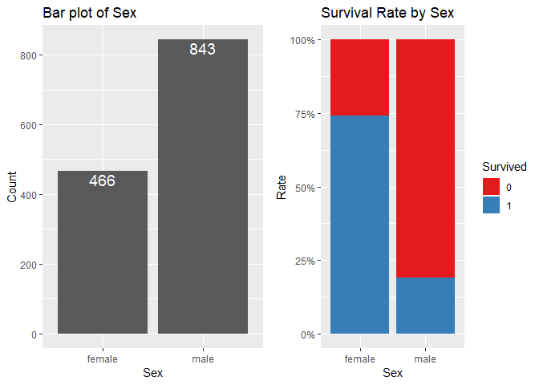

------------------------------------------------------------------------

<br>

1 Introduction
==============

인사이트 = 데이터의 분석 + 경험과 지식의 해석

인사이트의 두 가지 조건 중 첫 번째 조건을 충족하기 위해 캐글을 시작한다.

우선은 필사로 시작하며, 몇 번의 필사를 거친 후에 스스로 커널을 작성할 예정이다.

<https://www.kaggle.com/redhorse93/r-titanic-data>

이번 필사는 상기 커널이며, 'Competiton'중 'Titanic'에 대한 분석 과정을 담은 것이다.

<br>

------------------------------------------------------------------------

2 사전 준비
===========

<br>

2.1 Package
-----------

<br>

``` r
# Data input, assement: 데이터 로드, 확인
library(tidyverse)     # R의 통합 패키지로 여기서는 'readr'패키지를 쓰기 위함이다.
library(descr)         # descr::CrossTable() - 범주별 빈도수, 비율 수치로 확인

# Visualization
library(VIM)           #Missing values assement use by VIM::aggr()
#library(ggplot2)      #Used in almost visualzation 원문에선 따로 패키지를 부르지만, 
                       #tidyverse내에 포함된 패키지로 여기선 주석으로 처리한다.
library(RColorBrewer)  # plot의 color 설정
library(scales)        # plot setting - x, y 축 설정

# Feature Engineering, Data Pre-processing
#library(tidyverse)    # 아래 패키지는 모두 포함하기에 주석 처리한다.
#library(dplyr)        # Feature Engineering & Data Pre-processing
#library(purrr)        # Check missing values
#library(tidyr)        # tidyr::gather()

# Model generation
library(randomForest)  # For Random Forest Modeling

# Model validation :   원문 커널에선 생략된 내용이다.
#library(caret)        # caret::confusionMatrix()
#library(ROCR)         # Plotting ROC Curve
```

<br>

### multiplot() function generation

<br>

한 화면에 여러개 'plot'들을 표기하기 위해 'multiplot()' 함수를 사용한다.

하지만 원문의 필자는 어떤 문제가 생겨 'multiplot()'함수를 사용할 수 없어,

'CRAN'을 참고하여 'multiplot()'함수를 생성해서 사용했다.

<br>

``` r
# Multiple plot function
#
# ggplot objects can be passed in ..., or to plotlist (as a list of ggplot objects)
# - cols:   Number of columns in layout
# - layout: A matrix specifying the layout. If present, 'cols' is ignored.
#
# If the layout is something like matrix(c(1,2,3,3), nrow=2, byrow=TRUE),
# then plot 1 will go in the upper left, 2 will go in the upper right, and
# 3 will go all the way across the bottom.
#

multiplot <- function(..., plotlist = NULL, file, cols = 1, layout = NULL) {
  library(grid)
  
  # Make a list from the... arguments and plotlist
  plots <- c(list(...), plotlist)
  
  numPlots = length(plots)
  
  # If layout is NULL< then use 'cols' to determine layout
  if (is.null(layout)) {
    # Make the panel
    # ncol: number of columns of plots
    # nrow: Number of rows needed, calculated from # of cols
    layout <- matrix(seq(1, cols * ceiling(numPlots/cols)),
                     ncol = cols, nrow = ceiling(numPlots/cols))
  }
  
  if (numPlots==1) {
    print(plots[[1]])
    
  } else {
    # Set up the page
    grid.newpage()
    pushViewport(viewport(layout = grid.layout(nrow(layout), ncol(layout))))
    
    # Make each plot, in the correct location
    for (i in 1:numPlots) {
      # Get the i, j matrix positions of the regions that contain this subplot
      matchidx <- as.data.frame(which(layout == i, arr.ind = TRUE))
      
      print(plots[[i]], vp = viewport(layout.pos.row = matchidx$row,
                                      layout.pos.col = matchidx$col))
    }
  }
 }
```

<br>

2.2 Raw data import : 데이터 원본 로드
--------------------------------------

<br>

'Model'을 생성하는데 쓰는 'train' data와 실제 예측에 쓰는 'test' data가 분리되어 있다.

2개 data를 로드한 후에 묶을 예정이다.

분리된 data를 묶는 이유는 모델링에 사용되는 입력 변수들을 Feature Engineering,

Pre-processing 할 때 동일하게 작업하기 위해서이다.

<br>

``` r
train <- readr::read_csv("./input/train.csv")

test  <- readr::read_csv("./input/test.csv")

full  <- dplyr::bind_rows(train, test)
```

<br>

'read\_csv()'가 'read.csv'보다 로딩 속도가 조금 더 빠르기에 이 함수를 사용한다.

주의점은 문자열('Character')와 요인 변수('Factor')를 구별하지 않고 모두 'Chr'로 저장된다.

데이터를 'full'로 묶으면서 'rbind()'대신 'bind\_rows()'를 쓴 이유는 'test'에는

'Titanic competition'의 종속변수(타겟변수, Y)인 'Survived'가 없어서 데이터의

차원('dimention')이 맞지 않다. 그래서 'rbind()'로는 병합되지 않기에 후자를 썻다.

'bind\_rows()'는 'test'의 'Survived'를 'NA'로 처리하면서 하나로 병합이 가능하다.

<br>

2.3 변수 의미 설명
------------------

각 변수의 의미와 지정한 속성은 아래 표와 같다.

<br>

|      변수명     | 해석(의미)                                                                    | Type       |
|:---------------:|:------------------------------------------------------------------------------|:-----------|
| **PassengerID** | 승객을 구별하는 고유 ID number                                                | Int        |
|   **Survived**  | 승객의 생존 여부를 나타내며 생존은 1, 사망은 0                                | Factor     |
|    **Pclass**   | 선실의 등급으로서 1등급(1)부터 3등급(3)까지 3개 범주                          | Ord.Factor |
|     **Name**    | 승객의 이름                                                                   | Factor     |
|     **Sex**     | 승객의 성별                                                                   | Factor     |
|     **Age**     | 승객의 나이                                                                   | Numeric    |
|    **SibSp**    | 각 승객과 동반하는 형제 또는 배우자의 수를 설명하는 변수이며 0부터 8까지 존재 | Integer    |
|    **Parch**    | 각 승객과 동반하는 부모님 또는 자녀의 수를 설명하는 변수이며 0부터 9까지 존재 | Integer    |
|    **Ticket**   | 승객이 탑승한 티켓에 대한 문자열 변수                                         | Factor     |
|     **Fare**    | 승객이 지금까지 여행하면서 지불한 금액에 대한 변수                            | Numeric    |
|    **Cabin**    | 각 승객의 선실을 구분하는 변수이며 범주와 결측치가 너무 많다.                 | Factor     |
|   **Embarked**  | 승선항, 출항지를 나타내며 C, Q, S 3개 범주                                    | Factor     |

<br>

표보다 더 상세한 정보는 나무위키의 타이타닉 관련 링크를 참조 바란다.

[링크](https://namu.wiki/w/RMS%20%ED%83%80%EC%9D%B4%ED%83%80%EB%8B%89)

<br>

``` r
full <- full %>% 
  dplyr::mutate(Survived = factor(Survived),
                Pclass = factor(Pclass, ordered = T),
                Name = factor(Name),
                Sex = factor(Sex),
                Ticket = factor(Ticket),
                Cabin = factor(Cabin),
                Embarked = factor(Embarked))
```

<br>

------------------------------------------------------------------------

<br>

3 탐색적 데이터 분석(EDA : Exploratory Data Analysis)
=====================================================

<br>

결측치, 이상치 외 data 확인 작업 과정

여러 함수와 시각화를 사용하여 확인

<br>

3.1 수치값을 활용한 data 확인
-----------------------------

<br>

'head()'와 'summary()'로 data 확인

<br>

### 3.1.1 head()

<br>

``` r
head(full, 10)
```

    ## # A tibble: 10 x 12
    ##    PassengerId Survived Pclass Name  Sex     Age SibSp Parch Ticket  Fare
    ##          <dbl> <fct>    <ord>  <fct> <fct> <dbl> <dbl> <dbl> <fct>  <dbl>
    ##  1           1 0        3      Brau~ male     22     1     0 A/5 2~  7.25
    ##  2           2 1        1      Cumi~ fema~    38     1     0 PC 17~ 71.3 
    ##  3           3 1        3      Heik~ fema~    26     0     0 STON/~  7.92
    ##  4           4 1        1      Futr~ fema~    35     1     0 113803 53.1 
    ##  5           5 0        3      Alle~ male     35     0     0 373450  8.05
    ##  6           6 0        3      Mora~ male     NA     0     0 330877  8.46
    ##  7           7 0        1      McCa~ male     54     0     0 17463  51.9 
    ##  8           8 0        3      Pals~ male      2     3     1 349909 21.1 
    ##  9           9 1        3      John~ fema~    27     0     2 347742 11.1 
    ## 10          10 1        2      Nass~ fema~    14     1     0 237736 30.1 
    ## # ... with 2 more variables: Cabin <fct>, Embarked <fct>

<br>

결과를 보면 'Age'에 결측치가 있다.

'Age'외 다른 변수들엔 결측치가 없는지는 추후에 확인한다.

<br>

### 3.1.2 str()

<br>

``` r
str(full)
```

    ## Classes 'spec_tbl_df', 'tbl_df', 'tbl' and 'data.frame': 1309 obs. of  12 variables:
    ##  $ PassengerId: num  1 2 3 4 5 6 7 8 9 10 ...
    ##  $ Survived   : Factor w/ 2 levels "0","1": 1 2 2 2 1 1 1 1 2 2 ...
    ##  $ Pclass     : Ord.factor w/ 3 levels "1"<"2"<"3": 3 1 3 1 3 3 1 3 3 2 ...
    ##  $ Name       : Factor w/ 1307 levels "Abbing, Mr. Anthony",..: 156 287 531 430 23 826 775 922 613 855 ...
    ##  $ Sex        : Factor w/ 2 levels "female","male": 2 1 1 1 2 2 2 2 1 1 ...
    ##  $ Age        : num  22 38 26 35 35 NA 54 2 27 14 ...
    ##  $ SibSp      : num  1 1 0 1 0 0 0 3 0 1 ...
    ##  $ Parch      : num  0 0 0 0 0 0 0 1 2 0 ...
    ##  $ Ticket     : Factor w/ 929 levels "110152","110413",..: 721 817 915 66 650 374 110 542 478 175 ...
    ##  $ Fare       : num  7.25 71.28 7.92 53.1 8.05 ...
    ##  $ Cabin      : Factor w/ 186 levels "A10","A11","A14",..: NA 107 NA 71 NA NA 164 NA NA NA ...
    ##  $ Embarked   : Factor w/ 3 levels "C","Q","S": 3 1 3 3 3 2 3 3 3 1 ...

<br>

data는 12열(변수) 1309행(관측치.train: 891, test: 418)이다.

그 외 각 변수의 속성과 'factor' 속성의 변수들에 범주가 몇 개 인지도 확인 가능하다.

'head()' 결과 'Age'외 'Cabin' 에도 결측치가 있음을 알 수 있다.

<br>

### 3.1.3 summary()

<br>

``` r
summary(full)
```

    ##   PassengerId   Survived   Pclass                                Name     
    ##  Min.   :   1   0   :549   1:323   Connolly, Miss. Kate            :   2  
    ##  1st Qu.: 328   1   :342   2:277   Kelly, Mr. James                :   2  
    ##  Median : 655   NA's:418   3:709   Abbing, Mr. Anthony             :   1  
    ##  Mean   : 655                      Abbott, Master. Eugene Joseph   :   1  
    ##  3rd Qu.: 982                      Abbott, Mr. Rossmore Edward     :   1  
    ##  Max.   :1309                      Abbott, Mrs. Stanton (Rosa Hunt):   1  
    ##                                    (Other)                         :1301  
    ##      Sex           Age            SibSp            Parch      
    ##  female:466   Min.   : 0.17   Min.   :0.0000   Min.   :0.000  
    ##  male  :843   1st Qu.:21.00   1st Qu.:0.0000   1st Qu.:0.000  
    ##               Median :28.00   Median :0.0000   Median :0.000  
    ##               Mean   :29.88   Mean   :0.4989   Mean   :0.385  
    ##               3rd Qu.:39.00   3rd Qu.:1.0000   3rd Qu.:0.000  
    ##               Max.   :80.00   Max.   :8.0000   Max.   :9.000  
    ##               NA's   :263                                     
    ##       Ticket          Fare                     Cabin      Embarked  
    ##  CA. 2343:  11   Min.   :  0.000   C23 C25 C27    :   6   C   :270  
    ##  1601    :   8   1st Qu.:  7.896   B57 B59 B63 B66:   5   Q   :123  
    ##  CA 2144 :   8   Median : 14.454   G6             :   5   S   :914  
    ##  3101295 :   7   Mean   : 33.295   B96 B98        :   4   NA's:  2  
    ##  347077  :   7   3rd Qu.: 31.275   C22 C26        :   4             
    ##  347082  :   7   Max.   :512.329   (Other)        : 271             
    ##  (Other) :1261   NA's   :1         NA's           :1014

<br> 'summary()'는 많은 것을 알 수 있다.

수량형(Integer, Numeric) 변수들의 대표값, 범주형(Factor) 변수들의 범주 갯수,

범주별 관측치 갯수까지 확인이 가능하다.

아래 사항들은 변수에 대한 간략 설명이다.

1.  `Survived` : 이번 `competition`의 타겟 변수이며 418개의 결측치는 Test data 때문이다.

2.  `Pclass` : 1등급, 2등급, 3등급으로 범주가 세 개인데 3등급 승객이 가장 많다.

3.  `Name` : 이름이 비슷한 사람들이 있다. 따라서 혼자 탄 승객도 있지만 가족들과 같이 탑승한 승객도 있음을 알 수 있다.

4.  `Sex` : 남성이 여성보다 2배 가까이 더 많다.

5.  `Age` : 0.17부터 80세까지 있는데 0.17을 잘못 기입한 이상치 인건지 확인이 필요해보이며, 263개의 결측치가 존재한다.

6.  `SibSp` : 0부터 8까지 있는데 3분위수가 1이므로 부부 혹은 형제와 함께 Titanic호에 탑승했음을 알 수 있다.

7.  `Parch` : 0부터 9까지 있지만 3분위수가 0인 것을 통해서 부모, 자녀들과 함께 탄 승객들이 거의 없음을 알 수 있다.

`SibSp`와 `Parch`는 모두 가족관계를 나타내는 변수들이다. 이를 활용하여 가족 중 누가 탔는지는 모르지만 동승한 인원이 총 몇 명인지 구하고, 그것을 바탕으로 가족의 규모를 나타내는 `FamilySized` 라는 범주형 파생변수도 만들 것이다.

1.  `Ticket` : `3.1.2 str()`의 결과와 같이보면 완전히 동일한 티켓을 가진 승객들도 있고, 티켓이 일정 부분만 겹치는 승객들도 있고 아예 다른 티켓을 가진 승객이 있음을 알 수 있다. 이것을 이용해서 `ticket.size`라는 파생변수를 만들 것이다.

2.  `Fare` : 0부터 512까지 있고 1개의 결측치가 있다. 3분위수가 31.275이지만 최댓값이 512라 갭이 너무 커서 확인해 봐야겠다.

3.  `Cabin` : 총 12개 Feature들 중에서 가장 많은(1014개) 결측치를 갖고 있다. 배의 구역을 나타내는 변수인데 활용할 방법이 없다면 버려야 될 것 같다.

4.  `Embarked` : 총 3개 범주로 구성이 되어있고 S가 가장 많으며 2개의 결측치가 있다.

데이터를 탐색하기 전에 'summary()', 'str()' 같은 관측 함수들로 기본 정보를 확인하면 좋다.

<br>

3.2 Missing value
-----------------

<br>

변수의 결측치 여부와 있을 시 얼마나 존재하는지 확인하는 과정.

'dplyr', 'ggplot2',' VIM' 패키지들로 수치를 확인 후 시각화로 나타낼 예정이다.

<br>

### 3.2.1 VIM packages

<br>

``` r
VIM::aggr(full, prop = FALSE, combined = TRUE, numbers = TRUE, 
          sortVars = TRUE, sortCombs = TRUE)
```


    ## 
    ##  Variables sorted by number of missings: 
    ##     Variable Count
    ##        Cabin  1014
    ##     Survived   418
    ##          Age   263
    ##     Embarked     2
    ##         Fare     1
    ##  PassengerId     0
    ##       Pclass     0
    ##         Name     0
    ##          Sex     0
    ##        SibSp     0
    ##        Parch     0
    ##       Ticket     0

<br>

### 3.2.2 tidyverse packages

<br>

'VIM' 패키지가 아닌, 'tidyverse'로도 결측치를 확인할 수 있다.

'dplyr'로 변수별 결측치 비율을 알아본다.

<br>

``` r
full %>% 
  dplyr::summarise_all(funs(sum(is.na(.))/n()))
```

    ## Warning: funs() is soft deprecated as of dplyr 0.8.0
    ## please use list() instead
    ## 
    ## # Before:
    ## funs(name = f(.)
    ## 
    ## # After: 
    ## list(name = ~f(.))
    ## This warning is displayed once per session.

    ## # A tibble: 1 x 12
    ##   PassengerId Survived Pclass  Name   Sex   Age SibSp Parch Ticket    Fare
    ##         <dbl>    <dbl>  <dbl> <dbl> <dbl> <dbl> <dbl> <dbl>  <dbl>   <dbl>
    ## 1           0    0.319      0     0     0 0.201     0     0      0 7.64e-4
    ## # ... with 2 more variables: Cabin <dbl>, Embarked <dbl>

<br>

확인 결과 'Age','Cabin'외 'Survived', 'Fare','Embarked'에도 결측치가 있음을 알 수 있다.

결측치는 비율로 확인하는 방법도 있지만, 시각화를 통해 확인할 수도 있다.

<br>

``` r
# 각 feature의 결측치 비율 계산 -> Data Frame 속성 but 1행 12열 구조로 되어있다.
missing_values <- full %>% 
  dplyr::summarise_all(funs(sum(is.na(.))/n()))

# 위에서 구한 missing_values를 12x2 data frame으로 생성
missing_values <- tidyr::gather(missing_values,
                                key = 'feature', value = 'missing_pct')

# missing_values를 활용한 시각화
missing_values %>% 
  # Aesthetic setting: missing_pct 내림차순으로 정렬
  ggplot(aes(x = reorder(feature, missing_pct), y = missing_pct)) +
  # Bar plot
  geom_bar(stat = 'identity', fill = 'red') +
  # Title generation
  ggtitle('Rate of missing values in each features') +
  # Title detail setting
  theme(plot.title = element_text(face = 'bold',    #글씨체
                                  hjust = 0.5,       # Horizon(가로비율) 
                                  size = 15, 
                                  color = 'darkblue')) +
  # x, y axis label setting
  labs(x = 'Feature names', y = 'Rate') + 
  # Plot의 x, y 축 변환
  coord_flip()
```

 <br> 확인 결과 12개 변수중 총 5개에 결측치가 존재하며, 'Cabin','Age','Embarked','Fare'

순으로 결측치가 많음을 알 수 있다.('Survived'는 test data결합시 생긴 값으로 제외)

<br>

------------------------------------------------------------------------

<br>

시각화로 'feature'를 분석, 탐색해 보자.

3.3 Age
-------

<br>

``` r
age.p1 <- full %>% 
  ggplot(aes(Age)) +
  # 히스토그램 작성, 설정
  geom_histogram(breaks = seq(0, 80, by = 1), #간격 설정
                 col = 'red',     # 막대 경계선 색깔
                 fill = 'green',  # 막대 채우기 색깔
                 alpha = .5) +     # 막대 투명도 50%
  # Plot title
  ggtitle('All Titanic passengers age histogram') +
  theme(plot.title = element_text(face = 'bold',   #글씨체
                                    hjust = 0.5,  #Horizon(가로비율)
                                    size = 15,
                                    color = 'darkblue'))
  
age.p2 <- full %>% 
  # test data set의 Survived == NA 인 값들 제외
  filter(!is.na(Survived)) %>% 
  ggplot(aes(Age, fill = Survived)) +
  geom_density(alpha = .5) +
  ggtitle('Titanic passengers age density plot') +
  theme(plot.title = element_text(face = 'bold', hjust = 0.5,
                                  size = 15, color = 'darkblue'))
  
  # multiplot layout 형식 지정
  multi.layout = matrix(c(1, 1, 2, 2), 2, 2, byrow = T)
  
  # 위에서 생성한 2개의 그래프를 한 화면에 축력
  multiplot(age.p1, age.p2, layout = multi.layout)
```


<br>

3.4 Pclass
----------

각 'Pclass'에 해당하는 탑승객의 빈도수 시각화.

'dplyr'패키지 활용하여 'Pclass' 별로 그룹핑,

범주별 빈도수를 나타내는 'data frame' 생성한 후 'ggplot'으로 시각화

<br>

``` r
full %>% 
  # dplyr::group_by(), summarize() 를 이용해서 Pclass 빈도수 구하기
  group_by(Pclass) %>% 
  summarize(N = n()) %>% 
  # Aesthetic setting
  ggplot(aes(Pclass, N)) +
  geom_col() +
  # Pclass 빈도수 plot에 출력
  geom_text(aes(label = N),  #Plot의 y에 해당하는 N(빈도수) 매핑
            size = 5,   #글씨 크기
            vjust = 1.2,  #Vertical(가로) 위치 설정
            color = '#FFFFFF') +   #글씨 색깔 : 흰색
  # Plot title
  ggtitle("Number of each Pclass's passenger") +
  # Title setting
  theme(plot.title = element_text(face = 'bold', hjust = 0.5, size = 15)) +
  # x, y axis name change
  labs(x = 'Pclass', y = 'Count')
```


<br>

3등급 객실에 탑승한 승객이 가장 많이 사망.

객실 등급과 생존율간의 연관성은 'chapter5'에서 다룰 예정

<br>

3.5 Fare
--------

<br>

티켓값 'Fare' 시각화, histogram & boxplot으로 표현

``` r
  # Histogram
  Fare.p1 <- full %>% 
    ggplot(aes(Fare)) +
    geom_histogram(col = 'yellow',
                   fill = 'blue',
                   alpha = .5) +
  ggtitle('Histogram of passengers Fare') +
  theme(plot.title = element_text(face = 'bold', hjust = 0.5, size = 15))

  # Boxplot
  Fare.p2 <- full %>% 
    filter(!is.na(Survived)) %>% 
    ggplot(aes(Survived, Fare)) +
    # 관측치는 회색점, 중복되는 부분은 흩뿌려서 나타냄
    geom_jitter(col='gray') +
    # boxplot : xnaudeh 50%
    geom_boxplot(alpha = .5) +
    ggtitle('Boxplot of passengers Fare') +
    theme(plot.title = element_text(face = 'bold', hjust = 0.5, size= 15))
  
  # multiplot layout 형식 지정
  mulit.layout = matrix(c(1, 1, 2, 2), 2, 2)
  
  # 위에서 생성한 2개 그래프를 한 화면에 출력
  multiplot(Fare.p1, Fare.p2, layout = multi.layout)
```


<br>

생존자들이 사망한 승객들보다 'Fare'가 더 높지만 그렇게 큰 차이는 아님을 알 수 있다.

<br>

3.6 Sex
-------

성별간 생존율 차이의 시각화

<br>

``` r
sex.p1 <- full %>% 
  dplyr::group_by(Sex) %>% 
  summarize(N = n()) %>% 
  ggplot(aes(Sex, N)) +
  geom_col() +
  geom_text(aes(label = N), size = 5, vjust = 1.2, color = "#FFFFFF") + 
  ggtitle("Bar plot of Sex") +
  labs(x = "Sex", y = "Count")

sex.p2 <- full[1:891, ] %>% # 892행 이후부터는 'test' data로 생존율이 NA값임.
  ggplot(aes(Sex, fill = Survived)) +
  geom_bar(position = 'fill') +
  scale_fill_brewer(palette = "Set1") +
  scale_y_continuous(labels = percent) +
  ggtitle('Survival Rate by Sex') +
  labs(x = 'Sex', y = 'Rate')

multi.layout = matrix(rep(c(1, 2), times = 2), 2, 2, byrow = T)

multiplot(sex.p1, sex.p2, layout = multi.layout)
```



``` r
mosaicplot(Survived ~ Sex,
           data = full[1:891, ], col = TRUE,
           main = 'Survival rate by passengers gender')
```


<br>

그래프를 보면, 인원은 남성이 더 많지만, 생존율은 여성이 더 높음을 알 수 있다.

<br>

4 Feature Engineering & Data Pre-processing
===========================================

<br>

'Chapter 3 EDA'의 내용을 바탕으로 결측치를 채우고, 파생변수를 생성하는 과정

<br>

4.1 Age -&gt; Age.Group
-----------------------

<br>

``` r
full <- full %>%
  # 결측치 제외한 값들의 평균으로 결측치를 채움
  mutate(Age = ifelse(is.na(Age), mean(full$Age, na.rm = TRUE), Age),
         # Age 값에 따라 범주형 파생 변수 Age.Group 생성)
         Age.Group = case_when(Age < 13 ~ 'Age.0012',
                               Age >= 13 & Age < 18 ~ 'Age.1317',
                               Age >= 18 & Age < 60 ~ 'Age.1859',
                               Age >= 60 ~ 'Age.60inf'),
         # Chr 속성을 Factor로 변환
         Age.Group = factor(Age.Group))
```

<br>

4.2 SibSp & Parch -&gt; FamilySized
-----------------------------------

<br>

``` r
full <- full %>% 
  # SibSp, Parch와 1(본인)을 더해서 FamilySize라는 파생변수를 먼저 생성
  mutate(FamilySize = .$SibSp + .$Parch + 1,
         # FamilySize 의 값에 따라서 범주형 파생 변수 FamilySized를 생성
         FamilySized = dplyr::case_when(FamilySize == 1 ~ "Single",
                                        FamilySize >= 2 & FamilySize < 5 ~ "Small",
                                        FamilySize >= 5 ~ "Big"),
         # Chr 속성인 FamilySized를 factor로 변환
         # 집단 규모 크기에 따라 levels를 새로 지정
         FamilySized = factor(FamilySized, levels = c("Single", "Small", "Big")))
```

<br> 'SibSp', 'Parch'를 이용해서 'FamilySized'를 생성 두 개의 변수를 하나로 줄이면 모델이 단순화가 되어 파악이 용이 (ex. 키 & 체중으로 BMI 지수 산출)

<br>

4.3 Name & Sex -&gt; title
--------------------------

<br>

'Chapter 3.6 Sex'의 결과를 봤을 때 여성의 생존율이 남성보다 높음을 알 수 있다. 따라서 'Name'에서 '성별과 관련된 이름만을 추출해서 범주화 시키면 쓸모 있지 않을까?' 는 생각이 들어 그렇게 함수 생성 'full' data에서 'Name' 열만 추출하여 'title'로 저장

<br>

``` r
# Name 열 추출
title <- full$Name

# 정규표현식과 gsub()을 이요해서 성별과 관련성이 높은 이름만 추출해서 title 벡터로 저장
title <- gsub("^.*, (.*?)\\..*$", "\\1", title)

# 위에서 저장한 title 벡터를 full에 파생변수로 저장
full$title <- title
```

<br> 'Unique'한(고유한) 'title'에는 어떤 것들이 있는지 확인

<br>

``` r
unique(full$title)
```

    ##  [1] "Mr"           "Mrs"          "Miss"         "Master"      
    ##  [5] "Don"          "Rev"          "Dr"           "Mme"         
    ##  [9] "Ms"           "Major"        "Lady"         "Sir"         
    ## [13] "Mlle"         "Col"          "Capt"         "the Countess"
    ## [17] "Jonkheer"     "Dona"

<br> 총 18개의 범주가 확인됨. 이대로 쓸 경우 모델의 복잡도가 높아지기에(특히 Tree based model) 범주를 줄일 예정. 그 전에 'descr' 패키지를 이용해서 각 범주별 빈도수와 비율을 확인.

<br>

``` r
# 범주별 빈도수, 비율 확인
descr::CrossTable(full$title)
```

    ##    Cell Contents 
    ## |-------------------------|
    ## |                       N | 
    ## |           N / Row Total | 
    ## |-------------------------|
    ## 
    ## |         Capt |          Col |          Don |         Dona |
    ## |--------------|--------------|--------------|--------------|
    ## |            1 |            4 |            1 |            1 |
    ## |        0.001 |        0.003 |        0.001 |        0.001 |
    ## |--------------|--------------|--------------|--------------|
    ## 
    ## |           Dr |     Jonkheer |         Lady |        Major |
    ## |--------------|--------------|--------------|--------------|
    ## |            8 |            1 |            1 |            2 |
    ## |        0.006 |        0.001 |        0.001 |        0.002 |
    ## |--------------|--------------|--------------|--------------|
    ## 
    ## |       Master |         Miss |         Mlle |          Mme |
    ## |--------------|--------------|--------------|--------------|
    ## |           61 |          260 |            2 |            1 |
    ## |        0.047 |        0.199 |        0.002 |        0.001 |
    ## |--------------|--------------|--------------|--------------|
    ## 
    ## |           Mr |          Mrs |           Ms |          Rev |
    ## |--------------|--------------|--------------|--------------|
    ## |          757 |          197 |            2 |            8 |
    ## |        0.578 |        0.150 |        0.002 |        0.006 |
    ## |--------------|--------------|--------------|--------------|
    ## 
    ## |          Sir | the Countess |
    ## |--------------|--------------|
    ## |            1 |            1 |
    ## |        0.001 |        0.001 |
    ## |--------------|--------------|

<br>

18개나 되는 범주들의 빈도수와 비율이 너무 제각각. 총 5개 범주로 단순화

<br>

``` r
# 5개 범주로 단순화
full <- full %>% 
  # '%in%' 대신 '=='을 쓸 시 Recycling Rule 때문에 원하는대로 되지 않음.
  mutate(title = ifelse(title %in% c('Mlle', 'Ms', 'Lady', 'Dona'), 'Miss', title),
         title = ifelse(title == 'Mme', 'Mrs', title),
         title = ifelse(title %in% c('Capt', "col",'Major', 'Dr', 'Rev', 'Don',
                                     'Sir', "the Countess", 'Jonkheer'), "officer", title),
         title = factor(title))

# 파생변수 생성 후 각 범주별 빈도수, 비율 확인
descr::CrossTable(full$title)
```

    ##    Cell Contents 
    ## |-------------------------|
    ## |                       N | 
    ## |           N / Row Total | 
    ## |-------------------------|
    ## 
    ## |     Col |  Master |    Miss |      Mr |     Mrs | officer |
    ## |---------|---------|---------|---------|---------|---------|
    ## |       4 |      61 |     266 |     757 |     198 |      23 |
    ## |   0.003 |   0.047 |   0.203 |   0.578 |   0.151 |   0.018 |
    ## |---------|---------|---------|---------|---------|---------|

<br>

4.4 Ticket -&gt; ticket.size
----------------------------

<br> 'Chapter 3.1.3 Summary()' 확인 결과 승객은('train', 'test'합쳐서 모두) 1309명이다. 하지만 티켓은 모두 달라야 하지만 그렇지 않다. 'summary()'와 'unique()' 결과값을 확인하자

<br>

``` r
# 'unique'한 범주의 갯수만 파악하려고 length()를 사용
length(unique(full$Ticket))
```

    ## [1] 929

``` r
# 모두 출력하면 지저분하니 10개만 출력
head(summary(full$Ticket), 10)
```

    ##     CA. 2343         1601      CA 2144      3101295       347077 
    ##           11            8            8            7            7 
    ##       347082     PC 17608 S.O.C. 14879       113781        19950 
    ##            7            7            7            6            6

<br> 결측치가 없는 'feature'인데 unique한 티켓이 929개 뿐이다. 'CA. 2343'인 티켓은 11명이나 같다. 어떤 승객들인지 확인해보자.

<br>

``` r
full %>% 
  # 티켓이 일치하는 11명의 승객들 필터링
  filter(Ticket == 'CA. 2343') %>% 
  # 몇 가지 변수 확인
  select(Pclass, Name, Age, FamilySized)
```

    ## # A tibble: 11 x 4
    ##    Pclass Name                                    Age FamilySized
    ##    <ord>  <fct>                                 <dbl> <fct>      
    ##  1 3      Sage, Master. Thomas Henry             29.9 Big        
    ##  2 3      Sage, Miss. Constance Gladys           29.9 Big        
    ##  3 3      Sage, Mr. Frederick                    29.9 Big        
    ##  4 3      Sage, Mr. George John Jr               29.9 Big        
    ##  5 3      Sage, Miss. Stella Anna                29.9 Big        
    ##  6 3      Sage, Mr. Douglas Bullen               29.9 Big        
    ##  7 3      "Sage, Miss. Dorothy Edith \"Dolly\""  29.9 Big        
    ##  8 3      Sage, Miss. Ada                        29.9 Big        
    ##  9 3      Sage, Mr. John George                  29.9 Big        
    ## 10 3      Sage, Master. William Henry            14.5 Big        
    ## 11 3      Sage, Mrs. John (Annie Bullen)         29.9 Big

<br> 이 티켓의 11명은 모두 같은 가족 & 형제인 것을 알 수 있다. 티켓이 완전히 동일한 승객들이 있는 반면 일부분만 일치하는 승객들도 있다. 티켓의 Unique 넘버 갯수를 나타내는 'ticket.unique' 파생변수를 만들고, 'ticket.unique'를 바탕으로 3개 범주를 갖는 'ticket.size' 파생변수도 만든다.

<br>

``` r
# ticket.unique가 모두 0이라고 저장
ticket.unique <- rep(0, nrow(full))

# Ticket Feature에서 unique한 것들만 추출해서 tickets 벡터에 저장
tickets <- unique(full$Ticket)

# 반복문을 중첩 활용해서 티켓이 같은 승객들만 선별 후, 각 티켓의 길이를 추출하여 저장
for (i in 1:length(tickets)) {
  current.ticket <- tickets[i]
  party.indexes <- which(full$Ticket == current.ticket)
    # For loop 중첩
    for (k in 1:length(party.indexes)) {
      ticket.unique[party.indexes[k]] <- length(party.indexes)
    }
  }

# 위에서 계산한 ticket.unique를 파생변수로 저장
full$ticket.unique <- ticket.unique

# ticket.unique에 따라 세가지 범주로 나눠서 ticket.size 변수 생성
full <- full %>% 
  mutate(ticket.size = case_when(ticket.unique == 1 ~ 'Single',
                                 ticket.unique < 5 & ticket.unique >= 2 ~ 'Small',
                                 ticket.unique >= 5 ~ 'Big'),
         ticket.size = factor(ticket.size, 
                              levels = c('Single','Small','Big')))
```

<br>

4.5 Embarked
------------

<br>

결측치가 2개 있던 'feature'임 'Embarked'의 경우 3개 범주 중에서 가장 최반값인 'S'로 치환

<br>

``` r
full$Embarked <- replace(full$Embarked,               # 치환할 Data$feature 지정
                         which(is.na(full$Embarked)), # 결측치 찾기
                         'S')                         # 치환할 값 지정
```

<br>

4.6 Fare
--------

<br> 'Fare'의 경우 결측치가 유일하게 1개임 'Chapter 3.5 Fare'를 바탕으로 결측치를 0으로 치환

<br>

``` r
full$Fare <- replace(full$Fare, which(is.na(full$Fare)), 0)
```

<br>

-- 데이터 전처리 완료-- 이후, 지금까지 만든 파생변수들을 탐색하며 모델 생성에 사용할 변수 선별 'Feature selection'

<br>

------------------------------------------------------------------------

<br>

5 Relationship to target feature 'Survived' & Feature selection
===============================================================

<br>

각 변수와 생존율간 연관성 파악. 'test'는 생존.사망이 NA기 때문에 제외하고, 생존과 사망 여부를 알 수 있는 'train' data set만 사용함

<br>

5.0 Data set split
------------------

전처리 끝난 'full' data를 'train', 'test'로 분할

``` r
# feature selection 전이므로 모든 변수들을 선택
train <- full[1:891, ]

test <- full[892:1309, ]
```

<br>

5.1 Pclass
----------

<br>

``` r
train %>% 
  ggplot(aes(Pclass, fill = Survived)) +
  geom_bar(position = 'fill') +
  # plot 테마 설정 : 조금 더 선명한 색깔로 변환
  scale_fill_brewer(palette = 'Set1')  +
  # Y axis setting
  scale_y_continuous(labels = percent) +
  # x, y 축 이름과 plot의 main title, sub title 설정
  labs(x = 'Pclass', y = "Rate",
       title = "Bar plot", subtitle = 'How many people survived in each Pclass?')
```


<br>

5.2 Sex
-------

<br>

\*\* 'Chapter 3.6 Sex와 동일' \*\*

<br>

``` r
mosaicplot(Survived ~ Sex,
           data = train, col = TRUE,
           main = 'Survival rate by passengers gender')
```


<br>

5.3 Embarked
------------

<br>

``` r
train %>% 
  ggplot(aes(Embarked, fill = Survived)) +
  geom_bar(position = 'fill') +
  scale_fill_brewer(palette = 'Set1') +
  scale_y_continuous(labels = percent) +
  labs(x = 'Embarked', y = 'Rate',
       title = 'Bar plot', subtitle = 'How many people survied in each Embarked?')
```


<br>

5.4 FamilySized
---------------

<br>

``` r
train %>% 
  ggplot(aes(FamilySized, fill = Survived)) + 
  geom_bar(position = 'fill') +
  scale_fill_brewer(palette = 'Set1') +
  scale_y_continuous(labels = percent) +
  labs(x = "FamilySized", y = 'Rate',
       title = 'Bar plot', subtitle = 'Survival rate by FamilySized')
```


<br>

동승한 인원수에 따라 생존율에 차이가 있고, 'FamilySized'와 'Survived'는 비선형 관계임을 알 수 있다.

5.5 Age.Group
-------------

<br>

``` r
train %>% 
  ggplot(aes(Age.Group, fill = Survived)) +
  geom_bar(position = 'fill') +
  scale_fill_brewer(palette = 'Set1') +
  scale_y_continuous(labels = percent) +
  labs(x = 'Age group', y = 'Rate',
       title = 'Bar plot', subtitle = 'Survivla rate by Age group')
```


<br>

5.6 title
---------

<br>

``` r
train %>% 
  ggplot(aes(title, fill = Survived)) +
  geom_bar(position = 'fill') +
  scale_fill_brewer(palette = 'Set1') +
  scale_y_continuous(labels = percent) + 
  labs(x = 'title', y = 'Rate',
       title = 'Bar plot', subtitle = 'Survival rate by passengers title')
```


<br>

5.7 ticket.size
---------------

<br>

``` r
train %>% 
  ggplot(aes(ticket.size, fill = Survived)) +
  geom_bar(position = 'fill') + 
  scale_fill_brewer(palette = 'Set1') + 
  scale_y_continuous(labels = percent) +
  labs(x = 'ticket.size', y = 'Rate',
       title = 'Bar plot', subtitle = 'Survival rate by ticket.size')
```


<br>

5.8 Description of actual used features
---------------------------------------

<br>

생성한 파생변수들의 유효성을 확인했으니, 실제로 사용할 변수들만 선별해서 저장. 실제 선택한 변수들에 대한 간단한 설명

|      변수명     | Type   | 설명                                                                     |
|:---------------:|:-------|:-------------------------------------------------------------------------|
|   **Survived**  | factor | Target feature, 생존 == 1, 사망 == 0                                     |
|     **Sex**     | factor | 성별, `male` or `female`                                                 |
|    **Pclass**   | factor | 선실 등급, 1등급(1), 2등급(2), 3등급(3)                                  |
|   **Embarked**  | factor | 승선항, 사우샘프턴(S), 셸부르(C), 퀸즈타운(Q)                            |
| **FamilySized** | factor | 가족의 규모, `SibSp`와 `Parch`를 이용해서 만든 파생변수, 범주는 3개      |
|  **Age.Group**  | factor | 연령대, `Age`를 이용해서 만든 파생변수, 범주는 4개                       |
|    **title**    | factor | 이름의 일부분, `Name`을 이용해서 만든 파생변수, 범주는 5개               |
| **ticket.size** | factor | 티켓의 고유한 부분의 길이, `ticket`을 이용해서 만든 파생변수, 범주는 3개 |

<br>

``` r
# Id number 제외하고 실제로 사용할 7개 입력 변수와 1개 타겟 변수를 선택, 저장
train <- train %>% 
  select('Pclass', 'Sex', 'Embarked', 'FamilySized', 'Age.Group', 'title',
         'ticket.size', 'Survived')

# Submit을 위해 Id 열 추출하여 ID에 저장
ID <- test$PassengerId

# Id와 Survived를 제외한 나머지 6개 변수 선택, 저장
test <- test %>% 
  select('Pclass', 'Sex', 'Embarked', 'FamilySized', 'Age.Group','title','ticket.size')
```

<br>

------------------------------------------------------------------------

<Br>

6 Machine learning model generation
===================================

<br> 'train' data set으로 기계학습 'train', 'validation', 'test'로 교차검증('Cv')으로 선택을 하는게 맞지만,여기서는 'RandomForest'만을 생성하여 'test' data를 예측하고 'Submit'용 data까지만 생성.

<br>

6.1 Random Forest model generation
----------------------------------

<br>

``` r
# 재현성을 위해 seed number를 설정
set.seed(1901)

titanic.rf <- randomForest(Survived ~ ., data = train, importance = T, ntree = 2000)
```

<br>

6.2 Feature importance check
----------------------------

<br>

``` r
importance(titanic.rf)
```

    ##                     0        1 MeanDecreaseAccuracy MeanDecreaseGini
    ## Pclass      48.064732 55.31568             67.28920        37.485941
    ## Sex         51.578437 35.25159             55.65668        52.964241
    ## Embarked    -6.508585 34.61697             25.25949         9.178969
    ## FamilySized 32.340175 30.32503             49.78611        17.975488
    ## Age.Group   13.612591 26.62673             27.85438        10.103775
    ## title       49.855871 43.81056             59.36445        77.800504
    ## ticket.size 40.067927 39.48394             61.32680        22.520265

``` r
varImpPlot(titanic.rf)
```


6.3 Predict test data and create submit data
--------------------------------------------

<br>

``` r
# Prediction
pred.rf <- predict(object = titanic.rf, newdata = test, type = "class")

# Data frame generation
submit <-  data.frame(PassengerID = ID, Survived = pred.rf)

# Write the submit data frame to file: setwd()로 지정해놓은 폴더에 csv로 생성됨.
write.csv(submit, file = './titanic_submit.csv', row.names = F)
```

<br>

-- 완 --

7 Reference : 참고문헌
======================

1.  ['Megan Risdal' titanic kernel](https://www.kaggle.com/mrisdal)

2.  ['Heads or Tails' titanic kernel](https://www.kaggle.com/headsortails)

3.  [Hitesh palamada - Head Start for Data Scientist](https://www.kaggle.com/hiteshp/head-start-for-data-scientist)

4.  [나무위키 - RMS 타이타닉](https://namu.wiki/w/RMS%20%ED%83%80%EC%9D%B4%ED%83%80%EB%8B%89)

5.  R을 활용한 데이터 과학(인사이트), Garrett Grolemund, Hadley Wickham 지음, 김설기, 최혜민 옮김, 978-89-6626-235-9 : tidyverse를 이해하기 가장 좋은 책

6.  [tidyr::gather() - Software Carpentry](https://statkclee.github.io/r-novice-gapminder/14-tidyr-kr.html)

7.  머신러닝 탐구생활(비제이퍼블릭), 정권우 지음, 979-11-86697-69-6 : Data 분석 노트(표) 작성하는데 많은 도움을 받았습니다.

<br>

8. 원문 링크
============

\[링크\] <https://www.kaggle.com/redhorse93/r-titanic-data>

<br>
